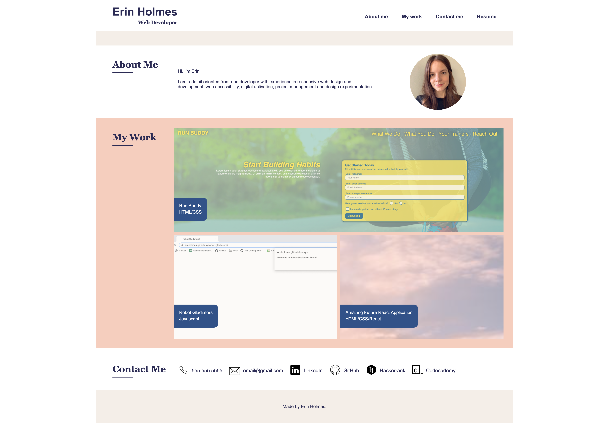

# Erin Holmes 
# Web Developer Portfolio

Welcome to my portfolio repo! This portfolio showcases my knowledge in advanced CSS and semantic HTML. It's also a work in progress and I will be adding to it as I complete more projects. 

Currently, you can find two projects. Selecting either one will take you to a deployed application. One called Run Buddy demonstrating my knowledge of semantic HTML. The second project is a game called Robot Gladiators created entirely with Javascript. The third spot under "My Work" is a placeholder for now. I hope to add a project created with React.

The phone number and email are both for display purposes only. The phone number is only clickable on phones/tablets. The other links under Contact Us are real links to my profiles. 

View portfolio: https://emholmes.github.io/my-portfolio/ (deployed application)

